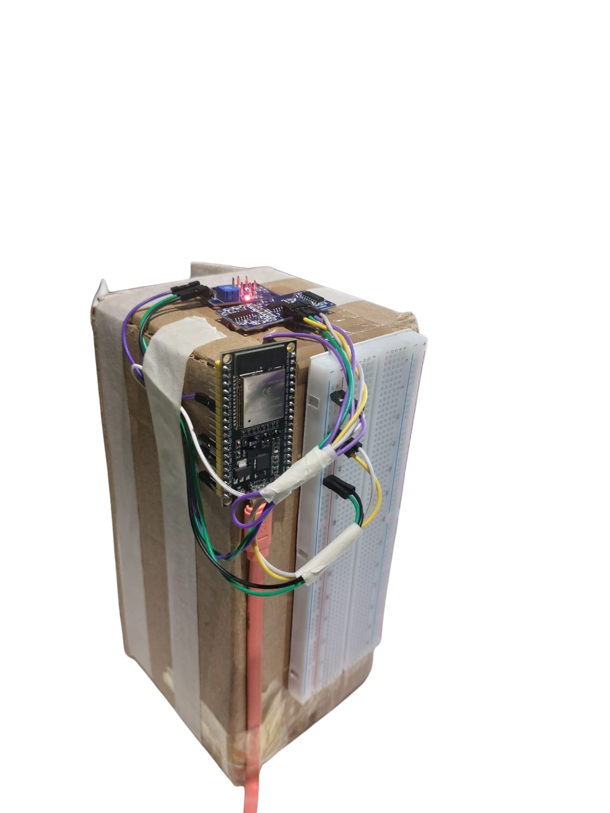

# MQ135 and HC-SR04 Sensor System with Firebase Integration

This project demonstrates how to use an MQ135 gas sensor and an HC-SR04 ultrasonic sensor with an ESP32 microcontroller to measure air quality (in PPM) and distance, respectively. The data is then sent to Firebase Realtime Database for storage and further analysis.


## Hardware Requirements
- **ESP32 Microcontroller**
- **MQ135 Gas Sensor** (connected to GPIO 32)
- **HC-SR04 Ultrasonic Sensor** (TRIG to GPIO 13, ECHO to GPIO 12)
- **Breadboard and Jumper Wires**
- **Power Supply** (e.g., USB cable)
- **Wi-Fi Connection** (for Firebase integration)


## Software Requirements
- **Arduino IDE** (with ESP32 board support installed)
- **Firebase ESP Client Library** (install via Arduino Library Manager)
- **WiFi.h** (included with ESP32 core)
- **Wire.h** (included with Arduino IDE)
- **NTPClient Library** (for time synchronization)


## Setup Instructions
1. **Connect the Hardware:**
   - Connect the MQ135 sensor to GPIO 32.
   - Connect the HC-SR04 sensor:
     - TRIG to GPIO 13
     - ECHO to GPIO 12
   - Power the ESP32 via USB or an external power source.

2. **Install Required Libraries:**
   - Open Arduino IDE.
   - Go to `Sketch > Include Library > Manage Libraries`.
   - Search for and install the following libraries:
     - `Firebase ESP Client`
     - `NTPClient` (if not already installed).

3. **Configure Wi-Fi and Firebase:**
   - Replace the `ssid` and `password` in the code with your Wi-Fi credentials.
   - Replace the `API_KEY` and `DATABASE_URL` with your Firebase project's API key and database URL.

4. **Upload the Code:**
   - Connect the ESP32 to your computer.
   - Select the correct board and port in Arduino IDE (`Tools > Board` and `Tools > Port`).
   - Upload the code to the ESP32.


## Circuit
  


## Code Overview
The code performs the following tasks:
1. **Initialization:**
   - Sets up serial communication.
   - Configures the MQ135 and HC-SR04 sensor pins.
   - Connects to Wi-Fi and synchronizes time with an NTP server.

2. **Sensor Readings:**
   - Reads PPM values from the MQ135 sensor.
   - Measures distance using the HC-SR04 sensor.

3. **Firebase Integration:**
   - Authenticates with Firebase using anonymous authentication.
   - Sends sensor data (PPM and distance) to Firebase Realtime Database with a timestamp.

4. **Loop:**
   - Continuously reads sensor data and sends it to Firebase every 6 seconds.


## Firebase Configuration
1. **Create a Firebase Project:**
   - Go to the [Firebase Console](https://console.firebase.google.com/).
   - Create a new project and enable the Realtime Database.

2. **Set Up Authentication:**
   - Enable anonymous authentication in the Firebase Console (`Authentication > Sign-in method`).

3. **Get API Key and Database URL:**
   - Go to `Project Settings > General` in the Firebase Console.
   - Copy the Web API Key and Database URL, and paste them into the code.

4. **Database Rules:**
   - Set the Realtime Database rules to allow read/write access (for testing purposes):
     ```json
     {
       "rules": {
         ".read": "auth != null",
         ".write": "auth != null"
       }
     }
     ```


## Usage
1. **Power On the Circuit:**
   - The ESP32 will connect to Wi-Fi and start sending data to Firebase.

2. **Monitor Serial Output:**
   - Open the Serial Monitor in Arduino IDE (`Tools > Serial Monitor`) to view sensor readings and Firebase status.

3. **View Data in Firebase:**
   - Go to the Firebase Console and navigate to the Realtime Database.
   - You should see sensor data organized by MAC address and timestamp.


## Troubleshooting
- **Wi-Fi Connection Issues:**
  - Ensure the Wi-Fi credentials are correct.
  - Check the ESP32's Wi-Fi signal strength.

- **Firebase Authentication Errors:**
  - Verify the API key and database URL.
  - Ensure anonymous authentication is enabled in Firebase.

- **Sensor Errors:**
  - Check the wiring of the MQ135 and HC-SR04 sensors.
  - Ensure the sensors are powered correctly.

- **NTP Time Sync Issues:**
  - Ensure the ESP32 is connected to the internet.
  - Check the NTP server address (`pool.ntp.org`).


